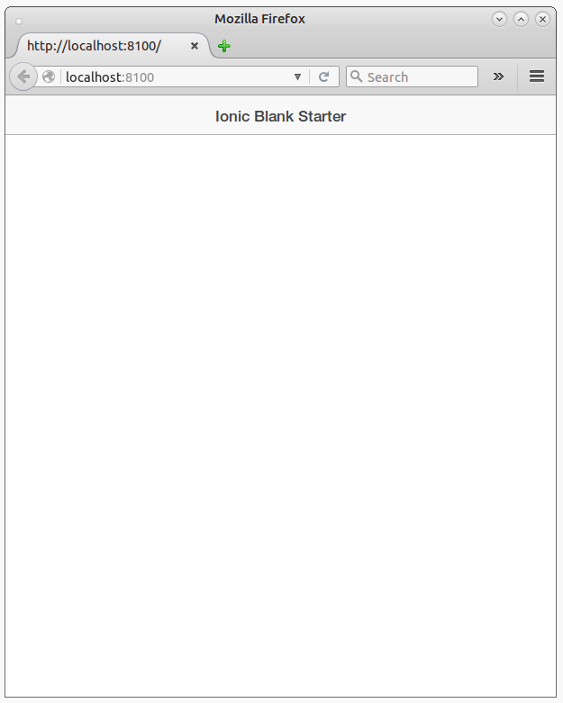
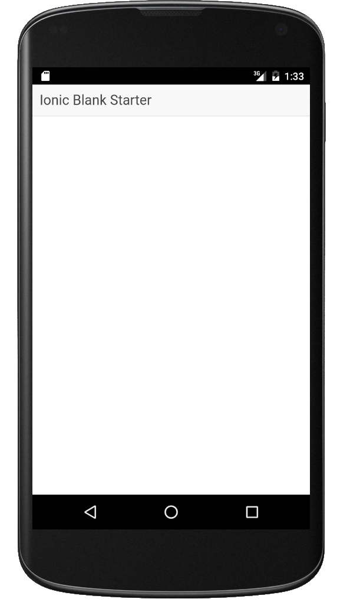

#  Ionic Angular Beers tutorial - Step 01

This is the initial step of the tutorial.  In this step you will install Ionic, create an empty application and test it in your browser
and eventually in your Android phone.

## Installing Ionic

First, install [NodeJS](http://nodejs.org). Then use `npm` to install [Apache Cordova](https://cordova.apache.org/) and  [Ionic](/http://ionicframework.com/):

```
npm install -g cordova
npm install -g ionic
```

Verify that both tools work by calling them on the command line:

```
$ cordova -v
5.4.1

$ ionic -v
1.7.10
```

## Create an empty Ionic application

To create an empty application in `app` folder, you simply do:

```
$ ionic start app blank
```

Then you can go to the `app` folder and test your new application by using `ionic serve`:

```
$ ionic serve
```

The `ionic serve` runs a web server on  `http://localhost:8100/` serving the Ionic application in web mode.



## Adding Android support

In order to add Android support you need to have Android build tools (SDK, platform tools, emulator...) in your computer.
The easiest way to do it is installing [Android Studio](http://developer.android.com/sdk/index.html).

To add Android support you do:

```
$ ionic platform add android
$ ionic build android
$ ionic emulate android
```


