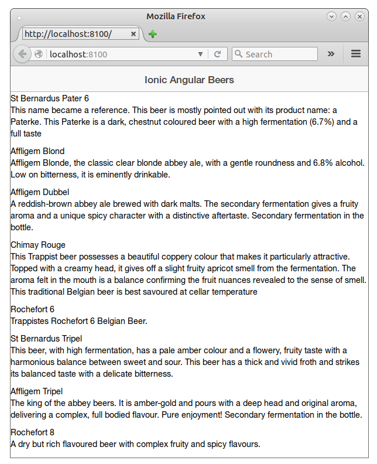

#  Ionic Angular Beers tutorial - Step 02 - Simple beer list

In this step we will take the basic beer list from Angular Beers tutorial and we will put it in the ionic application.


## Recovering beer data from Angular Beers

In this step we are using as dataset a list of 11 beers stored in JSON format that will be stored in `www/beers/beers.json`.
You can recover the dataset from the [step 05 of Angular Beers](https://github.com/LostInBrittany/angular-beers/tree/master/step-05) or directly from the solution of this step.

```JSON
[
  {
    "alcohol": 6.8,
    "description": "Affligem Blonde, the classic clear blonde abbey ale, with a gentle roundness and 6.8% alcohol. Low on bitterness, it is eminently drinkable.",
    "id": "AffligemBlond",
    "img": "beers/img/AffligemBlond.jpg",
    "name": "Affligem Blond"
  },
  {
    "alcohol": 6.8,
    "description": "A reddish-brown abbey ale brewed with dark malts. The secondary fermentation gives a fruity aroma and a unique spicy character with a distinctive aftertaste. Secondary fermentation in the bottle.",
    "id": "AffligemDubbel",
    "img": "beers/img/AffligemDubbel.jpg",
    "name": "Affligem Dubbel"
  },
  [...]
]
```

## The view and the controller

Let's begin by adding the beer list part of the UI of [step 05 of Angular Beers](https://github.com/LostInBrittany/angular-beers/tree/master/step-05) to the `index.html` of the application.

```html
<!--Body content-->
<ul class="beers" ng-controller="BeerListCtrl">
  <li ng-repeat="beer in beers | filter:query | orderBy:orderProp">
    <span>{{beer.name}}</span>
    <p>{{beer.description}}</p>
  </li>
</ul>
```

And then you add the `BeerListCtrl` controller to `js/app.js`. Inside it, we use the [$http](https://docs.angularjs.org/api/ng/service/$http) service in our controller to make an HTTP request to your web server to fetch the data in the `app/beers/beers.json` file.

```javascript
controller('BeerListCtrl', ['$scope', '$http', function($scope, $http) {

  $http.get('beers/beers.json').success(function(data) {
    $scope.beers = data;
  });

  $scope.orderProp = 'alcohol';
}])
```

So now we have a (rather ugly) beer list in our application.



## Summary ##

Now that you have an ugly beer list, go to [step 3](../step-03) to learn about using Ionic elements to make the list prettier.
