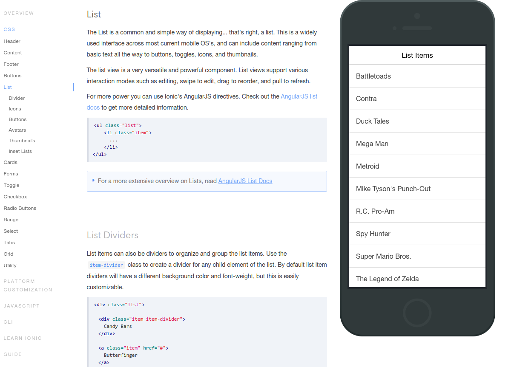
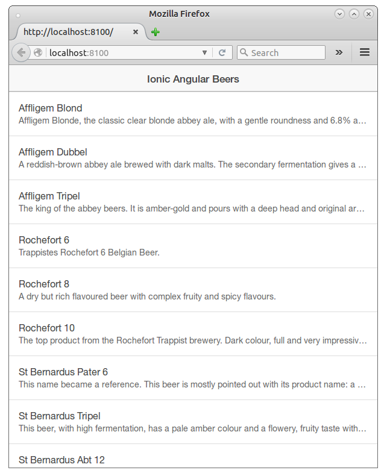

#  Ionic Angular Beers tutorial - Step 03 - Prettifying the list

In this step we will take the basic beer list from the [step 02](./step-02) and we will use Ionic CSS classes to make it prettier.

## Recovering beer images from Angular Beers

We begin by recovering the beer images from the [step 05 of Angular Beers](https://github.com/LostInBrittany/angular-beers/tree/master/step-05) and putting them inside the `www/beers/img` folder.

## Ionic element

Ionic proposes a [full catalog](http://ionicframework.com/docs/components/) of reusable and customizable front-end UI elements, adapted to the mobile world (look & feel, responsive design...). These elements are CSS classes, like in <a href="http://getbootstrap.com/">Twitter Bootstrap</a>.

So instead of simply using `<ul>` and `<li>` elements, we are going to use the [list classes](http://ionicframework.com/docs/components/#list) proposed by Ionic.



```html
<div class="list beers" ng-controller="BeerListCtrl">
  <div class="item" ng-repeat="beer in beers | filter:query | orderBy:orderProp">
    <span>{{beer.name}}</span>
    <p>{{beer.description}}</p>
  </div>
</div>
```

The look is already vastly improved:



## Adding images for the beers

Now we can add thumbnails of the beers to each list item:

```html
<div class="list beers" ng-controller="BeerListCtrl">
  <div class="item" ng-repeat="beer in beers | filter:query | orderBy:orderProp">
    
    <h2 class="beer-name">{{beer.name}}</h2>
    <div class="beer-description">{{beer.description}}</div>
  </div>
</div>
```

and then add the styles needed to make it look alright to the `www/styles/style.css`.

## Using Ionic list thumbnails

Instead of defining ourselves the thumbnails via CSS, we can simply use another of Ionic CSS list properties:
[item-thumbnails](http://ionicframework.com/docs/components/#item-thumbnails).

```html
<div class="list beers" ng-controller="BeerListCtrl">
  <div class="item item-thumbnail-left" ng-repeat="beer in beers | filter:query | orderBy:orderProp">
    
    <h2 class="beer-name">{{beer.name}}</h2>
    <div class="beer-description">{{beer.description}}</div>
  </div>
</div>
```

## Summary

In this step we have used Ionic CSS classes to make the list prettier and more ergonomic. In next step, [step 4](../step-04),
we are replacing these CSS classes with Ionic element, full fledged components (or directives, using Angular terminology).
