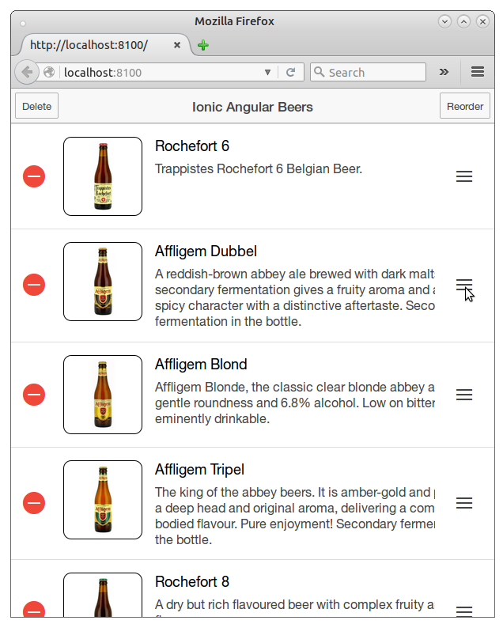

#  Ionic Angular Beers tutorial - Step 04 - AngularJS Extensions

In this step we are replacing the Ionic CSS classes used on [step-03](./step-03) with Ionic [AngularJS Extensions](http://ionicframework.com/docs/api/), full featured components that
can easily be used without coding through framework extensions.


## List AngularJS extensions: ion-list, ion-item

We are replacing the `list` and `item` CSS classes with the
[ion-list](http://ionicframework.com/docs/api/directive/ionList/)
and [ion-item](http://ionicframework.com/docs/api/directive/ionItem/).
Both elements are used declaratively, as normal AngularJS directives,
and they are easily configurable, with lots of advances features directly
available: thumbnails, delete buttons, reordering, swiping...

We are going to use two of these advances functionalities: delete and reorder buttons.
We begin by adding the two buttons to the header panel. Clicking on a button toggles the
associated property, that we are going to use to show or not the reordering and delete
buttons for each item.

```html
<ion-header-bar class="bar-stable">
  <div class="buttons">
    <button class="button" ng-click="shouldShowDelete = !shouldShowDelete">Delete</button>
  </div>
  <h1 class="title">Ionic Angular Beers</h1>
  <div class="buttons">
    <button class="button" ng-click="shouldShowReorder = !shouldShowReorder">Reorder</button>
  </div>
</ion-header-bar>
```

Now we can use the `ion-list` and `ion-item` components, without forgetting the `ion-delete-button`
and `ion-reorder-button` that will shown or not according to the value of `show-delete` and
`show-reorder` respectively

```html
<ion-list class="beers" ng-controller="BeerListCtrl"
      show-delete="shouldShowDelete" show-reorder="shouldShowReorder" >
  <ion-item class="beer-item" ng-repeat="beer in beers" type="item-text-wrap">
    
    <h2 class="beer-name">{{beer.name}}</h2>
    <div class="beer-description">{{beer.description}}</div>

    <ion-delete-button class="ion-minus-circled"
                       ng-click="beers.splice($index, 1)">
    </ion-delete-button>
    <ion-reorder-button class="ion-navicon"
                        on-reorder="reorderItem(beers, $fromIndex, $toIndex)">
    </ion-reorder-button>
  </ion-item>
</ion-list>
```

The `Array.splice` function is native in JavaScript, but for the reordering we need to create
a `reorderItem` function in the Controller:

```javascript
$scope.reorderItem = function(items, fromIndex, toIndex) {
  var item = items[fromIndex];
  items[fromIndex] = items[toIndex];
  items[toIndex] = item;
}
```



